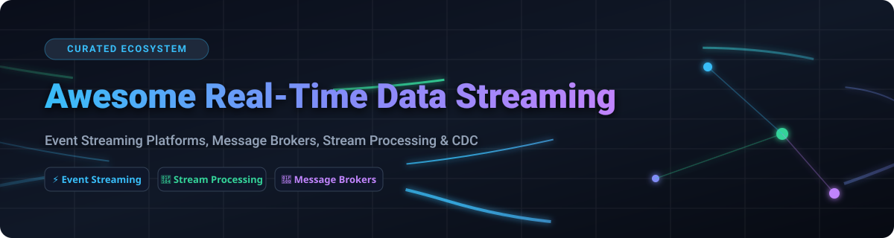

# 🚀 Awesome Real-Time Data Streaming Ecosystem

   

## 📚 Curated Guide to SaaS Platforms & Open-Source Streaming Technologies

*A comprehensive reference for Event Streaming, Message Brokers, Stream Processing Engines, Change Data Capture (CDC), and Real-Time Data Pipelines.*

**📅 Last updated: October 2026**

---

### 🔍 Overview & SEO Keywords
Real-time data streaming forms the operational backbone of modern event-driven architectures, real-time analytics, dynamic recommendation systems, microservices communication, and instant IoT processing. This curated list tracks top-tier **commercial SaaS platforms** and high-impact **open-source projects** designed to ingest, buffer, transform, and deliver continuous data streams at enterprise scale.

---

## 📌 Table of Contents

- [📊 Market Size & Industry Structure](#-market-size--industry-structure)
- [☁️ SaaS & Managed Streaming Platforms](#%EF%B8%8F-saas--managed-streaming-platforms)
- [🔓 Open-Source Streaming Projects](#-open-source-streaming-projects)
  - [⭐ Top Open-Source Ecosystem (Sorted by GitHub_Stars)](#-top-open-source-ecosystem-sorted-by-github-stars)
- [🤝 How to Contribute](#-how-to-contribute)
- [☕ Support & Sponsorship](#-support--sponsorship)
- [📈 Star History](#-star-history)
- [⚠️ Disclaimer & Best Practices](#%EF%B8%8F-disclaimer--best-practices)

---

## 📊 Market Size & Industry Structure

> 💡 **Market Insights (2026)**: The global real-time data streaming market is valued at **~$15.4 Billion in 2026** and is projected to reach **~$40.2 Billion by 2030** at a **21.5% CAGR**. The sector is **moderately fragmented**: while major cloud hyperscalers (AWS, Azure, GCP) command substantial enterprise share via managed services, specialized streaming vendors (such as Confluent, Redpanda, and Aiven) and a vibrant open-source ecosystem (Apache Kafka, Flink, Pulsar) maintain strong market independence, preventing a single winner-take-all consolidation.

---

## ☁️ SaaS & Managed Streaming Platforms

Below is a comparison of top managed real-time data streaming services, sorted by **Company Size / Valuation / Market Cap (Descending)**.

| Platform | 🎯 Target Use Case & Focus | 🏢 Company Valuation / Market Cap | 💵 Starting Pricing | 🎁 Free Tier & Trial Limits |
| :--- | :--- | :--- | :--- | :--- |
| **[Azure Event Hubs](https://azure.microsoft.com/en-us/products/event-hubs/)** | Enterprise big data streaming & event ingestion native to Microsoft Azure | **~$3.1 Trillion** *(Microsoft)* | **$0.015/hour** per Throughput Unit (~$11/mo) + **$0.028** per 1M events | **$200 free credit** (30 days) + **1,000,000 events/mo free** for 12 months |
| **[Amazon Kinesis Data Streams](https://aws.amazon.com/kinesis/data-streams/)** | Scalable real-time event streaming native to the AWS ecosystem | **~$2.1 Trillion** *(Amazon)* | **$0.015/shard-hour** + **$0.014** per 1,000,000 PUT Payload Units | **1,000,000 PUT records/month free** for 2 months via AWS Free Tier |
| **[Google Cloud Pub/Sub](https://cloud.google.com/pubsub)** | Global asynchronous pub/sub messaging native to Google Cloud Platform | **~$2.0 Trillion** *(Alphabet)* | **$40.00/TiB** (~$0.039/GB) for first 50 TiB ingested & delivered | **10 GB message ingestion & delivery free/month** (Free Forever) |
| **[Confluent Cloud](https://www.confluent.io/confluent-cloud/)** | Enterprise fully managed Apache Kafka, ksqlDB, Flink, and Schema Registry | **~$9.5 Billion** *(Confluent)* | **$0.00/hour** cluster fee + **$0.10/GB** data ingested / stored | **$400 in free credits** valid for 30 days upon sign up |
| **[Aiven for Apache Kafka](https://aiven.io/kafka)** | Multi-cloud managed Apache Kafka with built-in ecosystem integrations | **~$3.0 Billion** *(Aiven)* | **$0.086/hour** (~$63/month) per single-node startup plan | **30-day free trial** with **$300 free credits** across Aiven services |
| **[Redpanda Cloud](https://redpanda.com/)** | C++ Kafka-compatible streaming engine with zero JVM/Zookeeper overhead | **~$500 Million** *(Redpanda Data)* | **$0.14/GB** data ingested + **$0.03/GB/month** storage (Serverless) | **$300 free trial credits** valid for 14 days |
| **[Pulsar Cloud](https://streamnative.io/)** | Fully managed Apache Pulsar by StreamNative with multi-tenancy & tiered storage | **~$180 Million** *(StreamNative)* | **$0.10/GB** data processed + **$0.05/GB/month** storage | **50 GB data processing/month free forever** (Free Tier) |
| **[Decodable](https://www.decodable.co/)** | SQL-based real-time data pipelines & stream ETL built on Apache Flink | **~$100 Million** *(Decodable)* | **$0.50/Task Hour** + **$0.10/GB** data processed | **50 task hours/month + 10 GB data processed free forever** |
| **[Upstash Kafka](https://upstash.com/kafka)** | Serverless pay-per-request Apache Kafka for serverless & edge workloads | **~$50 Million** *(Upstash)* | **$0.60** per 100,000 commands/requests | **10,000 messages/day free forever** (up to 256KB message size) |

---

## 🔓 Open-Source Streaming Projects

Real-time data streaming is anchored by robust open-source software. The table below ranks prominent open-source streaming technologies sorted strictly by **GitHub Stars_Count (Descending)**.

### ⭐ Top Open-Source Ecosystem (Sorted by GitHub_Stars)

| Repository & Project | 🌟 GitHub Stars_Badge | 🛠️ Domain / Primary Category | ⚡ Key Features & Best Use Case |
| :--- | :---: | :--- | :--- |
| **[ClickHouse](https://github.com/clickhouse/clickhouse)** |  | Real-Time Analytical Database | High-performance column-oriented DBMS for real-time streaming analytics queries and instant dashboards. |
| **[Apache Spark](https://github.com/apache/spark)** |  | Unified Batch & Stream Processing | Structured Streaming engine providing micro-batch & continuous stream processing with exactly-once guarantees. |
| **[Apache Kafka](https://github.com/apache/kafka)** |  | Distributed Event Streaming | The de facto standard for high-throughput event streaming, powering event-driven backbones, Kafka Connect, & Kafka Streams. |
| **[Apache Flink](https://github.com/apache/flink)** |  | Stateful Stream Processing | Industry standard for low-latency, stateful stream processing with event-time semantics and savepoint state management. |
| **[NSQ](https://github.com/nsqio/nsq)** |  | Distributed Message Broker | Real-time distributed messaging platform designed for fault-tolerance and high availability without SPOF. |
| **[Vector](https://github.com/vectordotdev/vector)** |  | Observability Data Pipeline | High-performance Rust-based tool for collecting, transforming, and routing logs, metrics, and event streams. |
| **[Apache RocketMQ](https://github.com/apache/rocketmq)** |  | Distributed Messaging & Streaming | Low-latency, high-throughput distributed message broker with robust transactional messaging support. |
| **[NATS](https://github.com/nats-io/nats-server)** |  | Cloud-Native Messaging System | Lightweight, ultra-fast pub/sub messaging engine with JetStream for persistent event streaming and edge computing. |
| **[Apache Pulsar](https://github.com/apache/pulsar)** |  | Distributed Streaming & Pub/Sub | Multi-tenant, geo-replicated streaming platform with separated compute (Pulsar) and storage (BookKeeper). |
| **[RabbitMQ](https://github.com/rabbitmq/rabbitmq-server)** |  | Message Broker & Queueing | Versatile, widely deployed open-source message broker supporting AMQP, MQTT, STOMP, and stream protocols. |
| **[Fluentd](https://github.com/fluent/fluentd)** |  | Data Collector & Logging | Unified logging layer for collecting and consuming stream data across heterogenous environments. |
| **[Debezium](https://github.com/debezium/debezium)** |  | Change Data Capture (CDC) | Captures row-level database change events (MySQL, PostgreSQL, MongoDB) and streams them continuously to Kafka. |
| **[Redpanda](https://github.com/redpanda-data/redpanda)** |  | Kafka-Compatible Streaming | C++ based streaming platform wire-compatible with Kafka API, delivering up to 10x lower latency without JVM overhead. |
| **[Apache SeaTunnel](https://github.com/apache/seatunnel)** |  | Distributed Data Integration | High-performance, distributed mass data integration tool for synchronizing real-time and batch streaming data. |
| **[Apache Iceberg](https://github.com/apache/iceberg)** |  | Streaming Open Table Format | High-performance format for massive analytic tables supporting real-time streaming writes and ACID transactions. |
| **[Redpanda Connect (Benthos)](https://github.com/redpanda-data/connect)** |  | Declarative Stream Pipelines | Stream processing buffer and transformation engine configured entirely via simple declarative YAML files. |
| **[Apache Beam](https://github.com/apache/beam)** |  | Unified Stream/Batch SDK | Advanced portable data processing model compatible with Flink, Spark, Google Cloud Dataflow, and Samza. |
| **[Fluent Bit](https://github.com/fluent/fluent-bit)** |  | Lightweight Telemetry Pipeline | Fast, resource-efficient log, metric, and trace processor designed for Kubernetes, container, and embedded streams. |
| **[Apache NiFi](https://github.com/apache/nifi)** |  | Visual Dataflow Automation | Easy-to-use, visual data routing and transformation tool for enterprise real-time data flows. |
| **[Apache Pinot](https://github.com/apache/pinot)** |  | Real-Time Analytics OLAP | Distributed OLAP datastore designed for low-latency analytical queries on streaming event data. |
| **[Apache Samza](https://github.com/apache/samza)** |  | Stateful Stream Processing | Distributed stream processing framework built by LinkedIn operating natively on top of Kafka and Apache YARN. |
| **[ksqlDB](https://github.com/confluentinc/ksql)** |  | Event Streaming Database | Purpose-built event streaming database allowing developers to build stream processing applications using SQL. |

---

## 🤝 How to Contribute

Contributions are welcome! Please follow these simple guidelines:

1. 🍴 **Fork** this repository.
2. 📝 Update `README.md` keeping formatting, links, and sorting criteria consistent.
3. 💵 For SaaS entries: Ensure specific pricing tier and free plan/trial limits are stated.
4. ⭐ For Open-Source entries: Include the exact `style=social` Stars_Badge linking to the stargazers URL.
5. 🚀 Submit a **Pull Request** with a brief summary of additions or updates.

---

## ☕ Support & Sponsorship

Thank you so much for using and contributing to **Awesome Real-Time Data Streaming**! 💖

If you find this project helpful for your real-time data engineering, event-driven architectures, or platform research, please consider supporting the project:

- ⭐ **Star** this repository to show your appreciation!
- 🔀 **Fork** and share it with your teammates and network.
- 💬 Join our community on [Discord](https://discord.gg/jc4xtF58Ve).
- ☕ **Sponsor / Buy Me a Coffee**: Support ongoing maintenance on the [GitHub Sponsor Dashboard](https://github.com/sponsors/ishandutta2007).

---

## 📈 Star History

---

## ⚠️ Disclaimer & Best Practices

- 🛡️ **Community Curated**: This repository serves as a community catalog and does not constitute an endorsement.
- 📜 **Licensing Compliance**: Verify open-source software licenses against your organization's compliance policy (e.g., Apache-2.0 vs BSL vs CCL).
- 🔒 **Data Engineering Practices**: Ensure streaming systems deployed in production incorporate proper security encryption (TLS/mTLS), access control lists (ACLs), schema management, and monitoring.

---

<b>Made with ❤️ for Data Engineers, Software Architects, and Event-Driven Platform Teams.</b>

